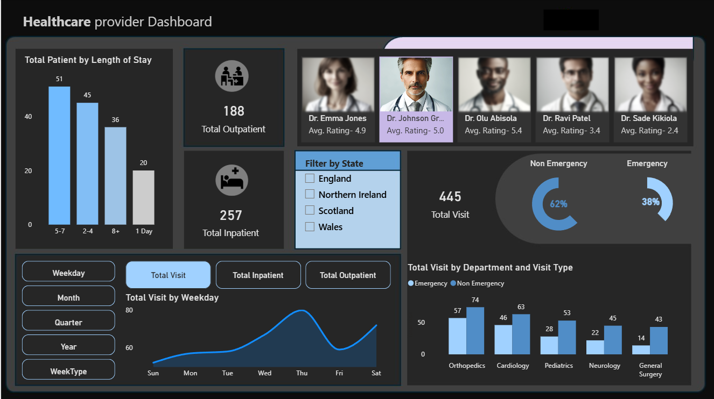
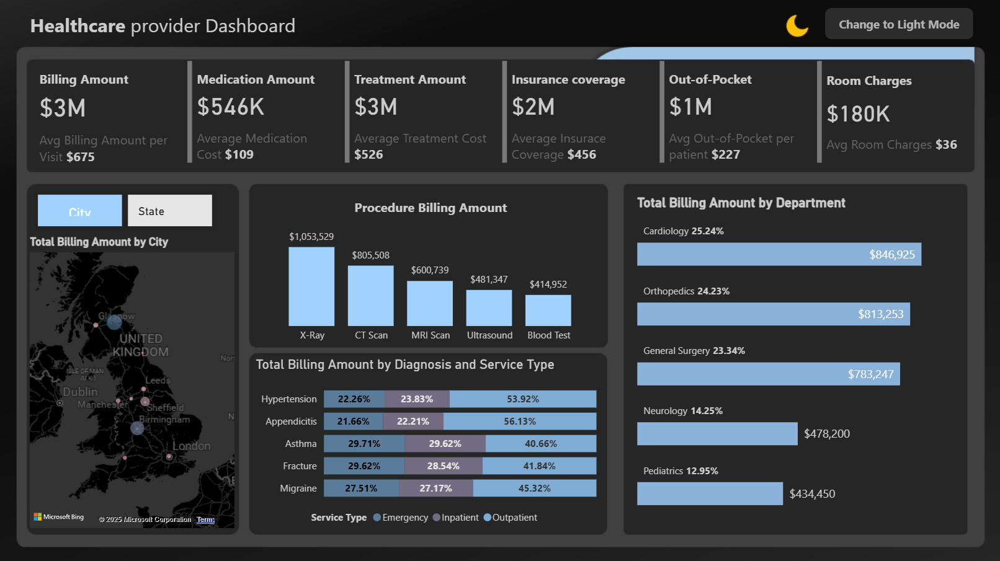
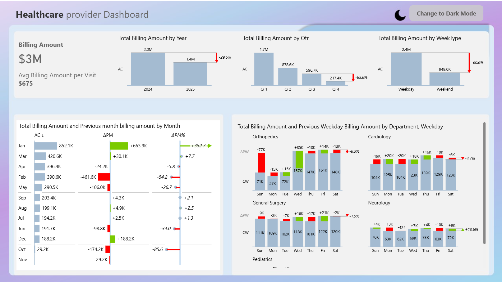

# 🏥 Healthcare Finance & Provider KPI Dashboard (Power BI)

A Power BI dashboard for provider KPIs and finance: **billing amount, medication/treatment cost, insurance coverage, length of stay, inpatient vs outpatient**, and more. Includes **dark/light mode toggles** and city/state drilldowns.

---

## 🔗 Live Dashboard
**Open in Power BI Service:** [App Powerbi Link](https://app.powerbi.com/reportEmbed?reportId=6ba35d2a-c376-4c8c-81c7-37cab0e9efdc&autoAuth=true&ctid=52d48b4c-a96a-4957-8557-71bd33686f3a
)

---

## 📌 Highlights
- Executive KPIs: **Total Billing**, **Medication & Treatment Costs**, **Out-of-Pocket**, **Room Charges**
- **Provider workload & patient mix** (inpatient vs. outpatient)
- **Diagnosis/Service Type** breakdown with benchmarking bars
- **By Department** view (Cardiology, Ortho, Pediatrics, Neurology, etc.)
- **City/State filters** for regional trends
- **Dark/Light mode** for presentation

---

## 🧩 How it’s built (Power BI)
- Semantic model with table relationships & dimension filters
- DAX for KPIs (e.g., Total Billing, Avg Cost per Patient)
- Clear layout for **exec summary → detail drilldowns**

---

## 🖼️ Screenshots
**Page 1 – Overview**  

**Page 2 – Finance breakdown**  

**Page 3 – Trend analysis (optional)**  

---

